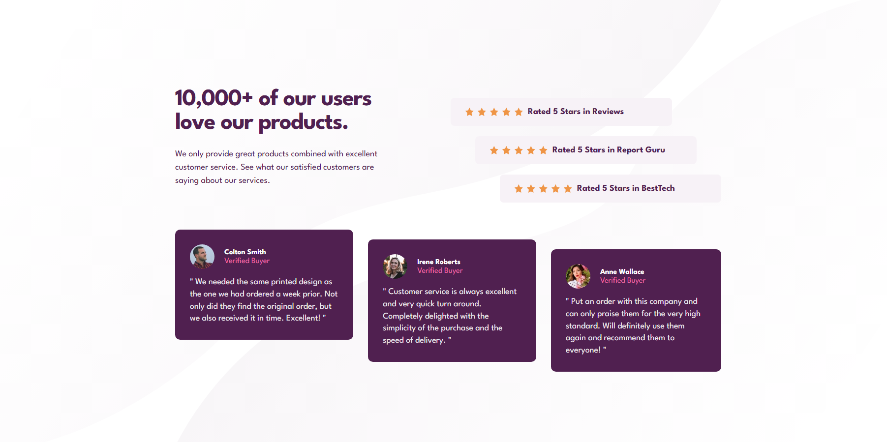

# Frontend Mentor - Секция социальных доказательств (Social proof section)

Это решение задачи [Social proof section challenge на Frontend Mentor](https://www.frontendmentor.io/challenges/social-proof-section-6e0qTv_b6). Испытания Frontend Mentor помогают улучшить навыки кодинга на реальных примерах.

### Задача

Пользователи должны иметь возможность:

- Просматривать оптимальный макет секции в зависимости от размера экрана их устройства.

### Скриншоты

### Ссылки

- Репозиторий решения: [https://github.com/thetaff/social-proof-section](https://github.com/thetaff/social-proof-section)
- Живой сайт (Live Site): [https://thetaff.github.io/social-proof-section/](https://thetaff.github.io/social-proof-section/)

## Мой процесс

### Использованные технологии

- Семантическая разметка HTML5
- Пользовательские свойства CSS (переменные)
- Flexbox
- Методология Mobile-first (сначала мобильные)

### Чему я научился

В этом проекте я сосредоточился на создании адаптивной "ступенчатой" верстки. Главной сложностью было реализовать эффект "лесенки" для карточек рейтинга и отзывов, используя селектор `:nth-child`.